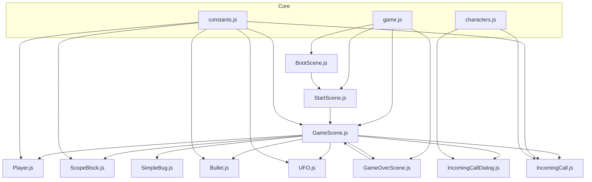
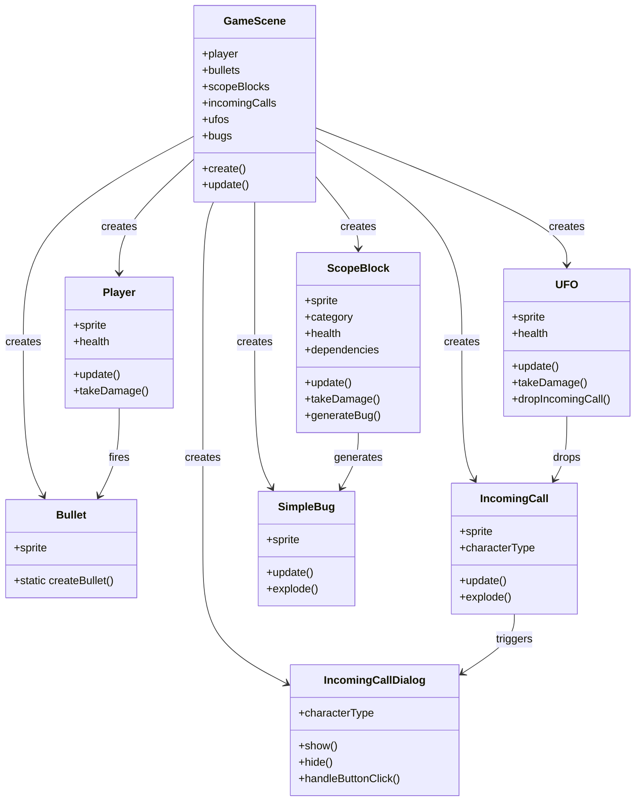
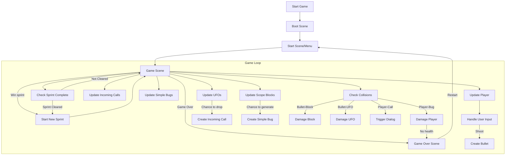

# Sprint Invaders Technical Documentation

## Codebase Overview

Sprint Invaders is a game built with Phaser 3, a JavaScript game framework. The codebase is organized into the following structure:

```
js/
├── constants.js
├── characters.js
├── game.js
├── ui.js
├── entities/
│   ├── Bullet.js
│   ├── IncomingCall.js
│   ├── IncomingCallDialog.js
│   ├── Player.js
│   ├── ScopeBlock.js
│   ├── SimpleBug.js
│   └── UFO.js
└── scenes/
    ├── BootScene.js
    ├── GameOverScene.js
    ├── GameScene.js
    └── StartScene.js
```

## Core Files Analysis

### game.js

The main entry point for the game, initializing the Phaser application and loading all scenes.

| Function | Description | Dependencies |
|----------|-------------|--------------|
| *No exported functions* | Configures and initializes the Phaser game | Imports all scene files and constants |

This file imports all the scenes and configures the Phaser game with the appropriate settings, including canvas dimensions and physics.

### constants.js

Contains all game constants like dimensions, colors, speeds, and probabilities.

| Constant Category | Description | Examples |
|------------------|-------------|----------|
| Game Configuration | Basic settings | `CANVAS_WIDTH`, `CANVAS_HEIGHT` |
| Game States | Possible game states | `PLAYING`, `OVER`, `MEETING` |
| Phaser Scene Keys | Scene identifiers | `BOOT`, `START`, `GAME`, `GAME_OVER` |
| Block Configuration | Block properties | `BLOCK_WIDTH`, `ROWS`, `COLS` |
| Character Settings | Character properties | `CHARACTER_TYPES`, `CHARACTER_PROPORTIONS` |
| Entity Properties | Properties for various entities | `BULLET_SPEED`, `PLAYER_WIDTH` |

## Scene Files

### scenes/GameScene.js

The main gameplay scene where most of the game logic occurs.

| Function | Description | Dependencies |
|----------|-------------|--------------|
| `constructor()` | Initializes the scene | N/A |
| `init(data)` | Sets up initial game state variables | N/A |
| `create()` | Creates game objects, UI, and sets up event handlers | Calls various creation methods |
| `update()` | Main game loop | Calls various update methods |
| `createPlayer()` | Creates the player entity | Player class |
| `createScopeBlocks()` | Creates the scope blocks for the current sprint | ScopeBlock class |
| `createBullet(x, y)` | Creates a bullet at specified position | Bullet class |
| `createScrumBoard()` | Creates the scrum board display | N/A |
| `createUI()` | Creates game UI elements | N/A |
| `updateCoffeeCupsDisplay()` | Updates the coffee cups display | N/A |
| `setupCollisions()` | Sets up collision handlers | Calls specific collision setup methods |
| `setupBlockCollisions()` | Sets up block-specific collisions | N/A |
| `setupInputHandlers()` | Sets up keyboard and input handling | N/A |
| `updatePlayer()` | Updates player entity | Player methods |
| `updateScopeBlocks()` | Updates scope block entities | ScopeBlock methods |
| `updateIncomingCalls()` | Updates incoming call entities | IncomingCall methods |
| `setupUFOSpawning()` | Sets up UFO spawn timers | N/A |
| `scheduleNextUFO()` | Schedules the next UFO spawn | N/A |
| `checkAndSpawnUFO()` | Checks if a UFO should spawn | N/A |
| `spawnUFO()` | Creates a new UFO entity | UFO class |
| `updateUFOs()` | Updates UFO entities | UFO methods |
| `handleBulletUFOCollision()` | Handles bullet-UFO collisions | N/A |
| `handleBulletBlockCollision()` | Handles bullet-block collisions | N/A |
| `handlePlayerBlockCollision()` | Handles player-block collisions | N/A |
| `handleBlockReachBottom()` | Processes blocks that reach bottom | N/A |
| `shoot()` | Player shooting logic | `createBullet()` |
| `checkSprintCleared()` | Checks if the current sprint is cleared | `startNewSprint()` |
| `startNewSprint()` | Starts a new sprint | `createScopeBlocks()`, `showSprintNotification()` |
| `showSprintNotification()` | Shows sprint transition notification | N/A |
| `updateScrumBoard()` | Updates the scrum board | N/A |
| `initGame()` | Initializes/resets game state | Multiple creation methods |
| `handleBulletIncomingCallCollision()` | Handles bullet-call collisions | N/A |
| `handlePlayerIncomingCallCollision()` | Handles player-call collisions | N/A |
| `createIncomingCall()` | Creates a new incoming call | IncomingCall class |
| `createBlock()` | Creates a new block with specified category | ScopeBlock class |
| `disposeBlock()` | Removes a block from the game | N/A |
| `createBlocks()` | Creates multiple blocks | `createBlock()` |
| `updateBugs()` | Updates bug entities | SimpleBug methods |
| `handlePlayerBugCollision()` | Handles player-bug collisions | N/A |
| `createSimpleBug()` | Creates a new bug entity | SimpleBug class |
| `resetEffects()` | Resets visual effects | N/A |
| `togglePause()` | Toggles game pause state | N/A |

### scenes/StartScene.js

The menu/start screen of the game.

| Function | Description | Dependencies |
|----------|-------------|--------------|
| `constructor()` | Initializes the scene | N/A |
| `create()` | Creates UI elements and setup | N/A |
| `startGame()` | Starts the main game | GameScene |

### scenes/GameOverScene.js

The game over screen shown when the player loses.

| Function | Description | Dependencies |
|----------|-------------|--------------|
| `constructor()` | Initializes the scene | N/A |
| `init(data)` | Receives end game data | N/A |
| `create()` | Creates UI elements and setup | N/A |
| `restartGame()` | Restarts the game | GameScene |

### scenes/BootScene.js

Initial loading scene for the game.

| Function | Description | Dependencies |
|----------|-------------|--------------|
| `constructor()` | Initializes the scene | N/A |
| `preload()` | Loads assets and resources | N/A |
| `create()` | Transitions to start scene | StartScene |

## Entity Files

### entities/Player.js

Player entity that the user controls.

| Function | Description | Dependencies |
|----------|-------------|--------------|
| `constructor(scene, x, y)` | Creates a player instance | N/A |
| `update()` | Updates player state | N/A |
| `takeDamage()` | Handles player damage | N/A |
| `resetVelocity()` | Resets player movement | N/A |

### entities/ScopeBlock.js

Represents the blocks/scopes that the player destroys.

| Function | Description | Dependencies |
|----------|-------------|--------------|
| `constructor(scene, x, y, category)` | Creates a scope block | N/A |
| `static createBlockGroup(scene)` | Creates a group for blocks | N/A |
| `update()` | Updates block state | N/A |
| `takeDamage()` | Handles block damage | N/A |
| `createDependencies()` | Sets up block dependencies | N/A |
| `makeVulnerable()` | Makes block vulnerable | N/A |
| `makeInvulnerable()` | Makes block invulnerable | N/A |
| `generateBug()` | Potentially generates a bug | SimpleBug class |

### entities/Bullet.js

Projectiles fired by the player.

| Function | Description | Dependencies |
|----------|-------------|--------------|
| `static createBulletGroup(scene)` | Creates a group for bullets | N/A |
| `static createBullet(scene, x, y)` | Creates a new bullet | N/A |

### entities/IncomingCall.js

Represents incoming call "bombs" that affect the player.

| Function | Description | Dependencies |
|----------|-------------|--------------|
| `constructor(scene, x, y, characterType)` | Creates a call instance | N/A |
| `static createIncomingCallGroup(scene)` | Creates a group for calls | N/A |
| `update()` | Updates call state | N/A |
| `explode()` | Handles call explosion | N/A |

### entities/IncomingCallDialog.js

Dialog for incoming calls with character interactions.

| Function | Description | Dependencies |
|----------|-------------|--------------|
| `constructor(scene, characterType)` | Creates a dialog | N/A |
| `show()` | Shows the dialog | N/A |
| `hide()` | Hides the dialog | N/A |
| `showMessage(message)` | Displays a message | N/A |
| `createButtons()` | Creates dialog buttons | N/A |
| `handleButtonClick()` | Handles button clicks | N/A |

### entities/UFO.js

Enemy UFO that drops incoming calls.

| Function | Description | Dependencies |
|----------|-------------|--------------|
| `constructor(scene, x, y)` | Creates a UFO instance | N/A |
| `static createUFOGroup(scene)` | Creates a group for UFOs | N/A |
| `update()` | Updates UFO state | N/A |
| `takeDamage()` | Handles UFO damage | N/A |
| `dropIncomingCall()` | Creates incoming call | IncomingCall class |

### entities/SimpleBug.js

Simple bug enemies that can damage the player.

| Function | Description | Dependencies |
|----------|-------------|--------------|
| `constructor(scene, x, y)` | Creates a bug instance | N/A |
| `static createBugGroup(scene)` | Creates a group for bugs | N/A |
| `update()` | Updates bug state | N/A |
| `explode()` | Handles bug explosion | N/A |

## Game Architecture Diagram



## Entity Relationships



## Game Flow Diagram



## Key Game Mechanics

1. **Player Movement and Shooting**
   - Player moves horizontally at the bottom of the screen
   - Player shoots bullets upward to destroy scope blocks

2. **Scope Blocks**
   - Different categories (S, M, L, XXL) with different health values
   - Move in formation (Space Invaders style)
   - Can have dependencies that make them invulnerable until dependencies are destroyed
   - Generate bugs that attack the player

3. **UFOs**
   - Move horizontally across the top of the screen
   - Drop incoming calls
   - Can be destroyed by player bullets for score

4. **Incoming Calls**
   - Fall vertically from UFOs or appear randomly
   - If they hit the bottom, explode and may damage player
   - If caught by player, trigger an IncomingCallDialog
   - Associated with different character types (good/evil)

5. **Bugs**
   - Generated by scope blocks 
   - Fall toward the player
   - Damage player on collision

6. **Sprint System**
   - Game is organized into "sprints"
   - Each sprint has a formation of scope blocks to destroy
   - Difficulty increases with each sprint
   - Sprint completes when all blocks are destroyed

## Performance Considerations

The game employs several techniques to maintain performance:

1. Object pooling for bullets and other frequently created/destroyed objects
2. Group-based collision detection rather than individual sprites
3. Phaser's built-in physics system for movement and basic collisions

## Extensibility

The codebase is designed to be extensible in several ways:

1. New entity types can be added by creating new classes in the entities directory
2. Game mechanics can be adjusted via constants in constants.js
3. New character types can be added to the characters.js file
4. Additional scenes can be created and integrated into the game flow
